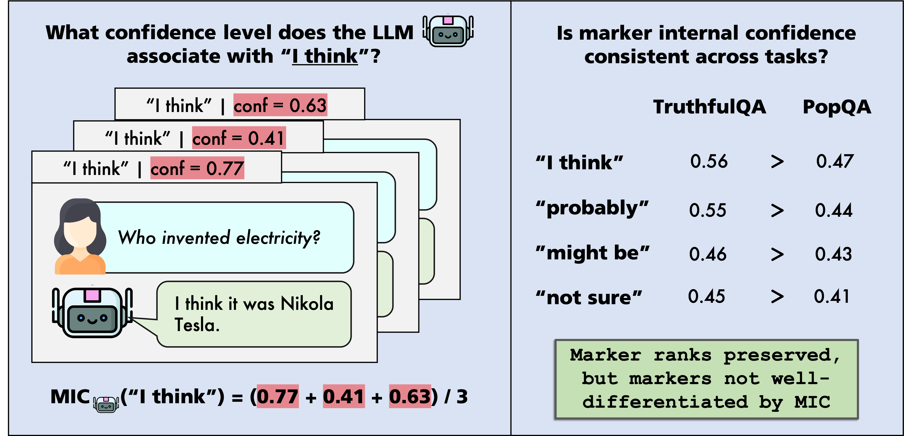

# Can LLMs Use Linguistic Uncertainty Markers to Reliably Reflect Intrinsic Confidence?

This repository provides code to reproduce the first systematic study of whether epistemic markers emitted by LLMs consistently and stably reflect their intrinsic confidence. We operationalize __marker internal confidence__ (MIC) as the internal confidence level an LLM associates with a specific epistemic marker, and introduce a suite of 7 metrics to evaluate the in- and out-of-distribution reliability of MICs across diverse models and tasks.

Overall, our findings show that even frontier LLMs struggle to consistently apply their own linguistic confidence framework, rounding out prior work on faithful calibration of LLMs. This underscores a fundamental alignment gap and the need to ground LLMs’ epistemic marker use in more stable and meaningful internal confidence representations.

<p align="center">
    <a href="" style="display:inline-block;background-color:#2196F3;color:white;padding:10px 20px;text-align:center;text-decoration:none;font-size:20px;border-radius:5px;">📄 <b>Paper</b></a>
</p>

<p align="center">
  
</p>


## Quick Links

- [🛠 Installation](#installation)
- [📂 File Structure](#structure)
- [📊 Experiments](#experiments)
- [🗂 Citation](#citation)

<a name="installation"></a> 

## 🛠 Installation

After cloning and navigating into the repository, create a conda environment and install the required dependencies:
```bash
conda create --name mic_env python=3.11
conda activate mic_env
pip install -r reqs.txt
python -m spacy download en_core_web_sm
```
Also specify your API keys to access proprietary and HuggingFace models:

```bash
export GOOGLE_API_KEY="your_api_key_here"
export OPENAI_KEY="your_api_key_here"
export HF_KEY="your_huggingface_key_here"
```

<a name="structure"></a> 

## 📂 File Structure

- `src/`: Core evaluation code.
  - `scripts/`: Main experiment and analysis scripts.
    - `compile_metrics.py`: Code to compile results across all models and tasks for easy viewing.
    - `compute_metrics.py`: Code to compute the 7 metrics analyzing MICs for a particular model.
    - `compute_statistics.py`: Code to calculate MICs for a particular model & associated plots/visualizations.
    - `inference_and_score.py`: Main code to run and score model predictions, prior to MIC calculation.
    - `plot_kde.py`: Script to analyze density of MICs per model per dataset, to determine whether models encode multiple distinguishable uncertainty levels.
    - `prompts.py`: Prompts used for LLM-as-a-Judge evaluation of decisiveness, sampled answer consistency, and task accuracy; extraction and standardization of hedges; and system prompts in main experiments.
    - `run_inference.sh`: Script to launch predictions for all datasets for a particular model.
    - `run_scoring.sh`: Script to launch scoring for all predictions for a particular model.
    - `run.sh`: Sample commands to reproduce main experimental results.
    - `score_decisiveness.py`: Helpers to quantify decisiveness of model-generated sentences.
    - `utils.py`: Utility functions.
  <!-- - `tasks/`: Module to prepare datasets/tasks for evaluation.
    - `__init__.py`: Registry of datasets/tasks used in experiments.
    - `_task.py`: Abstract class for task definitions.
    - `qa.py`: Class to handle tasks used in experiments. -->
- `reqs.txt`: Dependencies for environment creation.


<a name="experiments"></a> 

## 📊 Main Experiments

To evaluate and analyze marker internal confidences (MICs) on all datasets for a specific model with a specific system prompt (prompt options specified in `src/scripts/prompts.py`), run the following:

```bash
### Example Commands to Run MIC Computation & Analysis for Llama3.1-8B-Instruct
### Settings: 1 GPU, max 256 output tokens, max 5000 samples from each split, using generic system prompt (sys1), marker threshold 10

export PYTHONPATH=.

# Get Model Predictions
bash ./src/scripts/run_inference.sh meta-llama/Llama-3.1-8B-Instruct 0.9 1 train sys1 5000 256
bash ./src/scripts/run_inference.sh meta-llama/Llama-3.1-8B-Instruct 0.9 1 test sys1 5000 256

# Score Model Predictions (1 = extract hedges, 2 = score internal confidence & accuracy, 3 = score decisiveness, 4 = compile & score cMFG)
bash ./src/scripts/run_scoring.sh meta-llama/Llama-3.1-8B-Instruct 0.9 1 train sys1 5000 256 1 
bash ./src/scripts/run_scoring.sh meta-llama/Llama-3.1-8B-Instruct 0.9 1 train sys1 5000 256 2
bash ./src/scripts/run_scoring.sh meta-llama/Llama-3.1-8B-Instruct 0.9 1 train sys1 5000 256 3
bash ./src/scripts/run_scoring.sh meta-llama/Llama-3.1-8B-Instruct 0.9 1 train sys1 5000 256 4

bash ./src/scripts/run_scoring.sh meta-llama/Llama-3.1-8B-Instruct 0.9 1 test sys1 5000 256 1 
bash ./src/scripts/run_scoring.sh meta-llama/Llama-3.1-8B-Instruct 0.9 1 test sys1 5000 256 2
bash ./src/scripts/run_scoring.sh meta-llama/Llama-3.1-8B-Instruct 0.9 1 test sys1 5000 256 3
bash ./src/scripts/run_scoring.sh meta-llama/Llama-3.1-8B-Instruct 0.9 1 test sys1 5000 256 4

# Compute MICs + Statistics
python ./src/scripts/compute_statistics.py  --model_dir=./_results/meta_llama_Llama_3.1_8B_Instruct  --model_name=meta-llama/Llama-3.1-8B-Instruct --marker_count_threshold=10  --marker_count_for_plots=30 --split=train
python ./src/scripts/compute_statistics.py  --model_dir=./_results/meta_llama_Llama_3.1_8B_Instruct  --model_name=meta-llama/Llama-3.1-8B-Instruct --marker_count_threshold=10  --marker_count_for_plots=30 --split=test

# Compute Metrics (add flag --ignore_blank_hedge if ignoring the special marker <no_hedge>)
python ./src/scripts/compute_metrics.py  --df_dir=./_results/meta_llama_Llama_3.1_8B_Instruct/__marker_thresh_10/train/_dfs

# Plot KDE Analysis
python ./src/scripts/plot_kde.py  --csv_path=./_results/meta_llama_Llama_3.1_8B_Instruct/__marker_thresh_10/train/_dfs/shared_mic.csv --model_name="meta-llama/Llama-3.1-8B-Instruct"

```

Note that you may need to set the `CUDA_VISIBLE_DEVICES` variable before launching experiments to use the correct GPU(s). 

For proprietary models (e.g., `gpt-5-mini`, `gemini-3.1-pro`) the commands are similar:
```bash
### Example Commands to Run MIC Computation & Analysis for GPT-5-Mini
### Settings: 0 GPUs, max 512 output tokens, max 5000 samples from each split, using generic system prompt (sys1), marker threshold 10
export PYTHONPATH=.

# Get Model Predictions
bash ./src/scripts/run_inference.sh gpt-5-mini 0 0 train sys1 5000 512
bash ./src/scripts/run_inference.sh gpt-5-mini 0 0 test sys1 5000 512

# Score Model Predictions (1 = extract hedges, 2 = score internal confidence & accuracy, 3 = score decisiveness, 4 = compile & score cMFG)
bash ./src/scripts/run_scoring.sh gpt-5-mini 0 0 train sys1 5000 512 1 
bash ./src/scripts/run_scoring.sh gpt-5-mini 0 0 train sys1 5000 512 2 
bash ./src/scripts/run_scoring.sh gpt-5-mini 0 0 train sys1 5000 512 3 
bash ./src/scripts/run_scoring.sh gpt-5-mini 0 0 train sys1 5000 512 4

bash ./src/scripts/run_scoring.sh gpt-5-mini 0 0 test sys1 5000 512 1 
bash ./src/scripts/run_scoring.sh gpt-5-mini 0 0 test sys1 5000 512 2 
bash ./src/scripts/run_scoring.sh gpt-5-mini 0 0 test sys1 5000 512 3 
bash ./src/scripts/run_scoring.sh gpt-5-mini 0 0 test sys1 5000 512 4 

# Compute MICs + Statistics
python ./src/scripts/compute_statistics.py  --model_dir=./_results/gpt_5_mini  --model_name=gpt-5-mini --marker_count_threshold=10  --marker_count_for_plots=30 --split=train
python ./src/scripts/compute_statistics.py  --model_dir=./_results/gpt_5_mini --model_name=gpt-5-mini --marker_count_threshold=10  --marker_count_for_plots=30 --split=test

# Compute Metrics (add flag --ignore_blank_hedge if ignoring the special marker <no_hedge>)
python ./src/scripts/compute_metrics.py  --df_dir=./_results/gpt_5_mini/__marker_thresh_0/train/_dfs

# Plot KDE Analysis
python ./src/scripts/plot_kde.py  --csv_path=./_results/gpt_5_mini__marker_thresh_10/train/_dfs/shared_mic.csv --model_name="gpt-5-mini"

```

<a name="citation"></a> 

## 🗂 Citation

If you find the content of this project helpful, please cite our paper as follows:
```bash
Citation coming soon!
```
